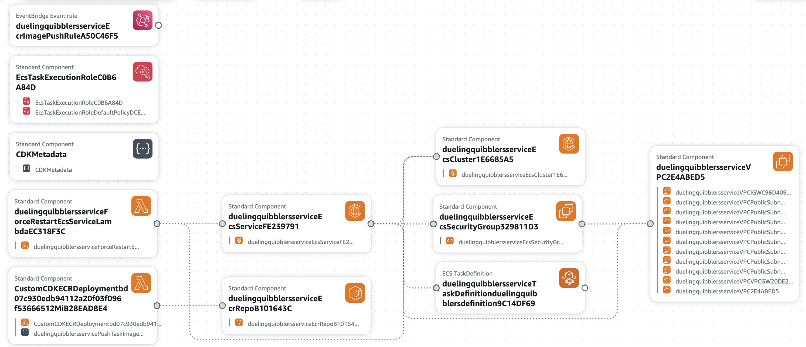

# Dueling Quibblers

A fun CLI application that creates debates between fantasy characters using LangGraph and AWS Bedrock. This assumes you configured AWS credentials on your laptop, as you need AWS credentials to access AWS Bedrock for the LLM (to generate each debaters arguments in their characters' arguments style).

Note: you will need AWS resources. If you don't have AWS credentials and want to only run locally, then switch to the `3.streamlit+ollama` branch to run with Ollama and not need AWS resources.

## Features

- Interactive CLI interface for debate setup (or in the browser with Streamlit frontend)
- Fantasy character debaters with unique personalities and speaking styles
- 3-round debate format with memory of previous arguments
- Powered by AWS Bedrock
- Built with LangGraph for structured conversation flow

## Setup to run locally on your laptop

1. Change directory to `ecs/` folder
```bash
cd ecs/
```

2. Create Python virtual environment, activate it, and install the dependencies in the virtual environment:
```bash
python3 -m venv .venv  # assumes you have a Python 3.11+ environment
source .venv/bin/activate  # if you are on a Mac, it's different if you are on Windows
pip3 install -r requirements.txt
```

3a. Run Dueling Quibblers on the command line:
```bash
python3 dueling_quibblers_v3.py
```

3b. Run Dueling Quibblers in a browser with Streamlit frontend:
```bash
streamlit run app_v2.py
```

## Usage

1. Enter the debate topic when prompted
2. Enter the first debater character (e.g., "Harry Potter", "Phoenix Wright")
3. Enter the second debater character
4. Watch as the characters debate with 3 rounds each!
5. Characters are randomly assigned affirmative/negative positions
6. Judge is randomly assigned and will give the verdict!

## Example

```
Topic: Should magic be taught in schools?
Debater 1: Harry Potter
Debater 2: Phoenix Wright

[Debate begins with 3 rounds each...]
```

## Deploying the Microservice Yourself
Stay in the root folder and run the following to deploy the following architecture:
```
python -m venv .venv
source .venv/bin/activate
pip3 install -r requirements.txt
cdk deploy  # Docker daemon must be running; also assumes AWS CLI is configured + npm installed with `aws-cdk`: detailed instructions at https://cdkworkshop.com/15-prerequisites.html
```
<p align="center"></p>
